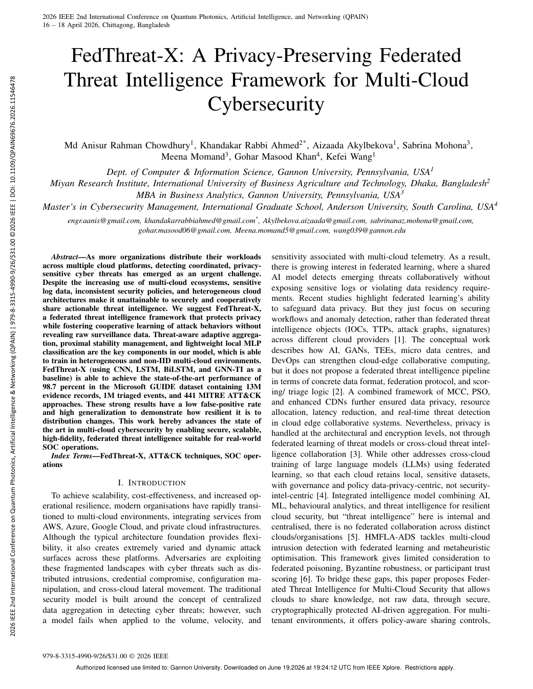
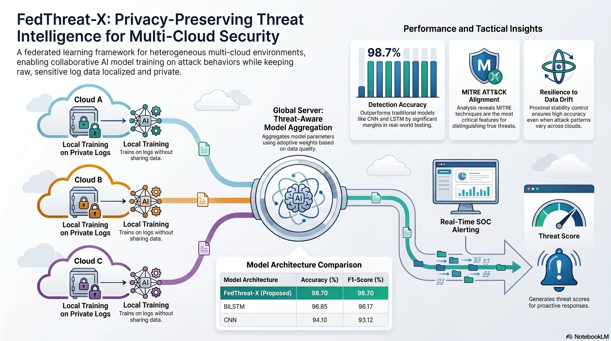
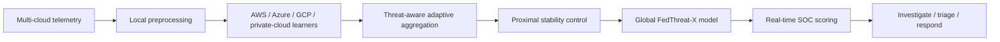
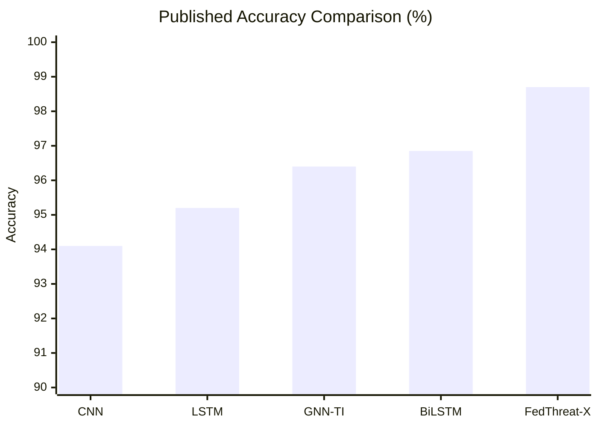
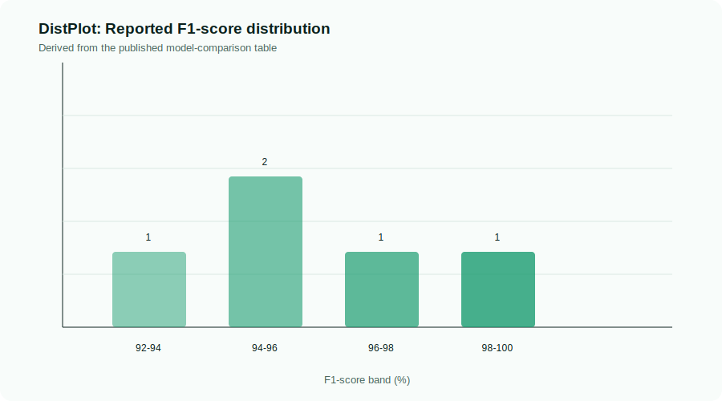
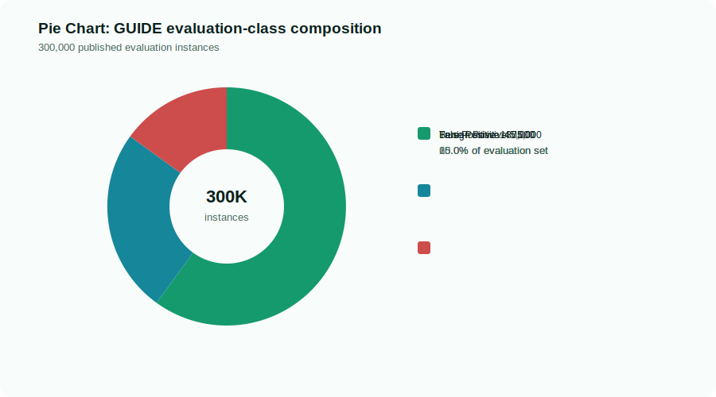
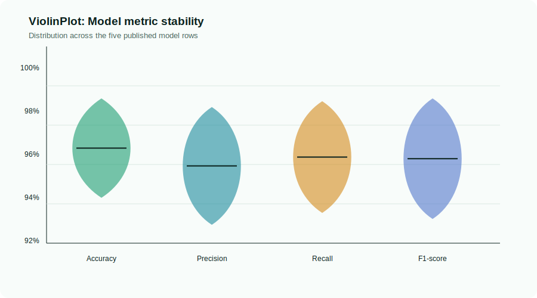
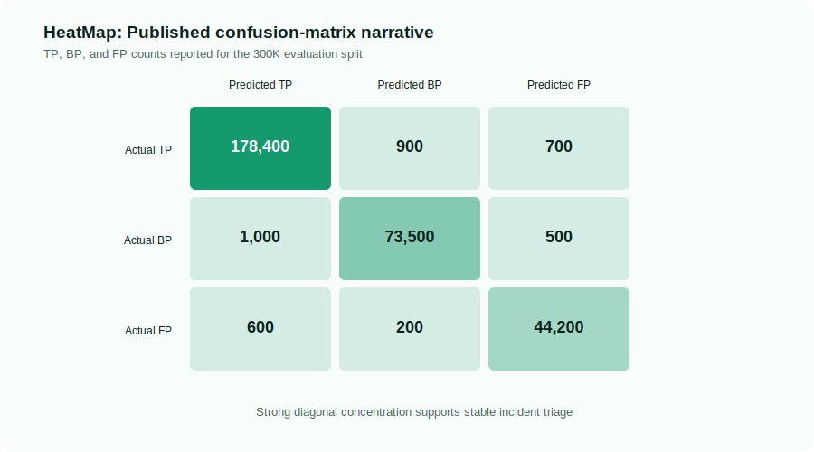
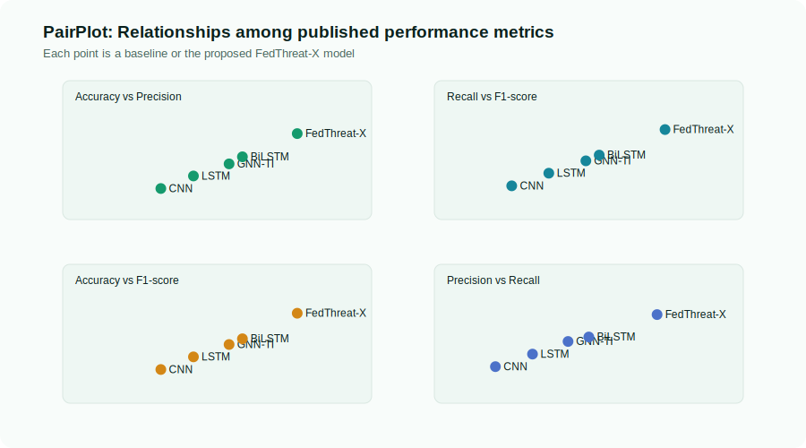
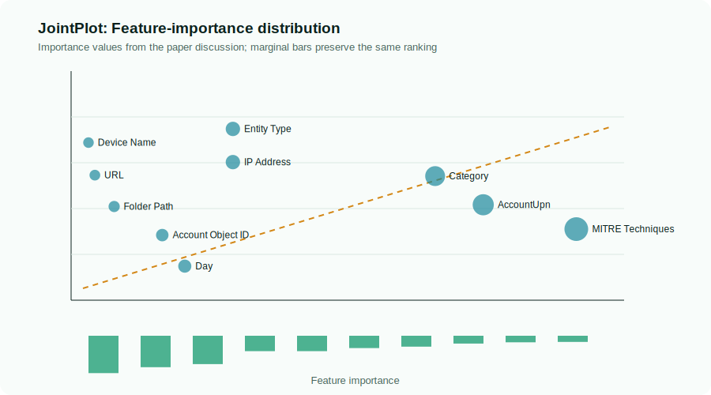

<div align="center">

# FedThreat-X

### A Privacy-Preserving Federated Threat Intelligence Framework for Multi-Cloud Cybersecurity

[](https://ieeexplore.ieee.org/document/11546478)
[](docs/index.html)
[](docs/index.html)
[](https://youtu.be/8kYnDgFR79g)

**Published:** April 16, 2026  
**Venue:** 2026 IEEE 2nd International Conference on Quantum Photonics, Artificial Intelligence & Networking (QPAIN)

[Research Portal](docs/index.html) | [Research Report](docs/report.html) | [Poster View](docs/poster.html) | [Implementation Guide](docs/implementation.html) | [Official IEEE Paper](https://ieeexplore.ieee.org/document/11546478) | [Google Scholar](https://scholar.google.com/citations?view_op=view_citation&hl=en&user=NQyywPoAAAAJ&citation_for_view=NQyywPoAAAAJ:NMxIlDl6LWMC)

</div>

<p align="center">
  
  
</p>

## Overview

FedThreat-X packages the published IEEE research into a complete, publication-oriented repository for privacy-preserving multi-cloud threat intelligence. The framework enables cloud environments to learn coordinated attack behavior without moving raw security telemetry outside its source boundary.

The approach combines a lightweight local MLP classifier, threat-aware adaptive aggregation, and proximal stability control to address heterogeneous, non-IID cloud telemetry while supporting real-time SOC threat scoring.

## Quick Links

| Resource | Link |
| --- | --- |
| GitHub Pages source | [docs/index.html](docs/index.html) |
| Expected Pages URL | `https://anis151993.github.io/FedThreat-X/` |
| Published paper | [IEEE Xplore record](https://ieeexplore.ieee.org/document/11546478) |
| IEEE Xplore | https://ieeexplore.ieee.org/document/11546478 |
| Google Scholar citation | https://scholar.google.com/citations?view_op=view_citation&hl=en&user=NQyywPoAAAAJ&citation_for_view=NQyywPoAAAAJ:NMxIlDl6LWMC |
| Project video | https://youtu.be/8kYnDgFR79g |

## Research Contribution

- Federated cross-cloud threat intelligence without sharing raw logs.
- Threat-aware aggregation that weighs client contributions by validation quality and threat drift.
- Proximal stability management for heterogeneous, non-IID multi-cloud environments.
- Lightweight local MLP classification and global SOC-ready inference.
- Evaluation on the Microsoft GUIDE dataset with **13M evidence records**, **1M triaged events**, and **441 MITRE ATT&CK techniques**.

## Methodology Snapshot



| Component | Published configuration |
| --- | --- |
| Local model | Lightweight 3-layer MLP classifier |
| Batch size | 256 samples per client round |
| Local training | 5 epochs per communication round |
| Optimizer | Adam, learning rate 0.001 |
| Proximal regularization | 0.05 |
| Communication rounds | 50 |
| Privacy guarantee | Raw logs never shared; model updates exchanged |

## Results Snapshot

| Model | Accuracy | Precision | Recall | F1-score |
| --- | ---: | ---: | ---: | ---: |
| CNN | 94.10% | 92.85% | 93.40% | 93.12% |
| LSTM | 95.20% | 94.10% | 94.65% | 94.37% |
| GNN-TI | 96.40% | 95.30% | 95.90% | 95.60% |
| BiLSTM | 96.85% | 96.00% | 96.35% | 96.17% |
| **FedThreat-X (Proposed)** | **98.70%** | **98.30%** | **98.57%** | **98.70%** |



## Static Plot Gallery

The following repository-native plots render directly in GitHub and GitHub Pages. They are reproducibly generated from the paper's reported aggregate metrics, class totals, confusion-matrix narrative, and feature-importance discussion. They do **not** claim access to unreleased raw telemetry.

<p align="center">
  
  
</p>

<p align="center">
  
  
</p>

<p align="center">
  
  
</p>

## Repository Structure

```text
.
├── DEPLOYMENT.md
├── IMPLEMENTATION_GUIDE.md
├── README.md
├── docs/
│   ├── index.html
│   ├── report.html
│   ├── poster.html
│   ├── implementation.html
│   ├── styles.css
│   ├── script.js
│   └── assets/
│       ├── data/project-metrics.json
│       ├── images/
│       │   ├── figures/paper-first-page.png
│       │   ├── plots/
│       │   └── fedthreat-x-framework.webp
└── scripts/generate_research_assets.py
```

## Reproducibility Notes

### Preserved materials

- The original published IEEE paper PDF.
- The supplied multi-cloud FedThreat-X framework infographic.
- A transparent data file at [project-metrics.json](docs/assets/data/project-metrics.json) containing the published aggregate evidence used for repository visualizations.

### What this repository does not claim

- It does not fabricate raw GUIDE telemetry, private cloud logs, training checkpoints, or unreleased experimental code.
- It does not present derived static chart marks as individual raw-data observations.

### Regenerate the visual asset layer

```bash
python3 scripts/generate_research_assets.py
```

## GitHub Pages

This repository is designed for deployment from `docs/`. See [DEPLOYMENT.md](DEPLOYMENT.md) for exact configuration steps.

## Citation

```bibtex
@inproceedings{rahmanchowdhury2026fedthreatx,
  title     = {FedThreat-X: A Privacy-Preserving Federated Threat Intelligence Framework for Multi-Cloud Cybersecurity},
  author    = {Md Anisur Rahman Chowdhury and Khandakar Rabbi Ahmed and Aizaada Akylbekova and Sabrina Mohona and Meena Momand and Gohar Masood Khan and Kefei Wang},
  booktitle = {2026 IEEE 2nd International Conference on Quantum Photonics, Artificial Intelligence \& Networking (QPAIN)},
  year      = {2026},
  month     = {April},
  day       = {16},
  url       = {https://ieeexplore.ieee.org/document/11546478}
}
```

## Lead Researcher

**Md Anisur Rahman Chowdhury**

- LinkedIn: https://linkedin.com/in/md-anisur-rahman-chowdhury-15862420a
- GitHub: https://github.com/ANIS151993
- Google Scholar: https://scholar.google.com/citations?user=NQyywPoAAAAJ
- Portfolio: https://marcbd.com
- ResearchGate: https://researchgate.net/profile/Md-Anisur-Rahman-Chowdhury

## Copyright

Copyright © 2026 **Md Anisur Rahman Chowdhury**. All rights reserved.
